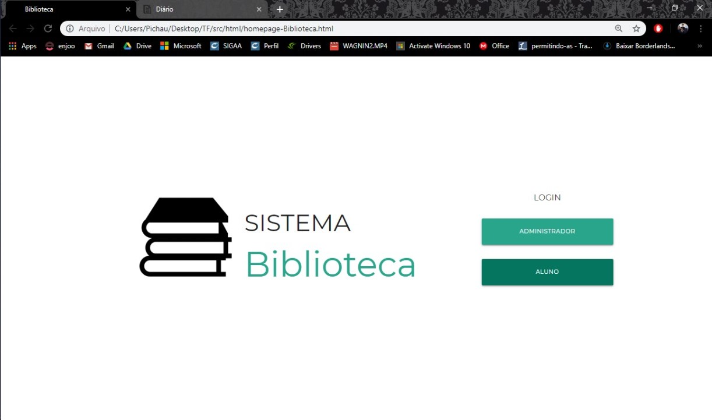
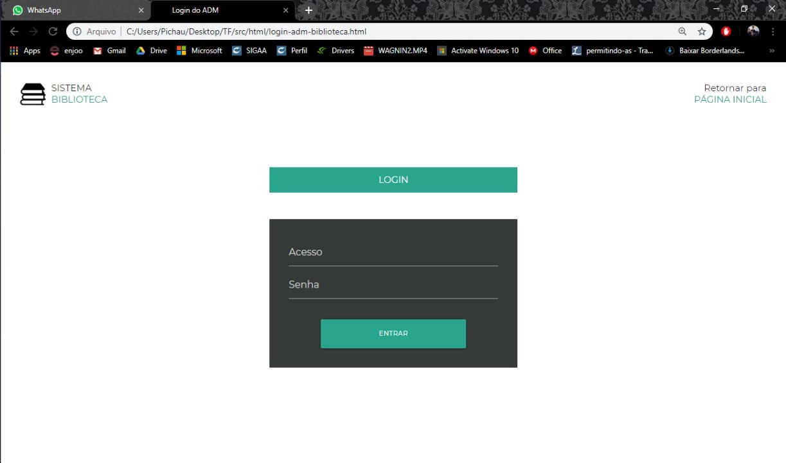
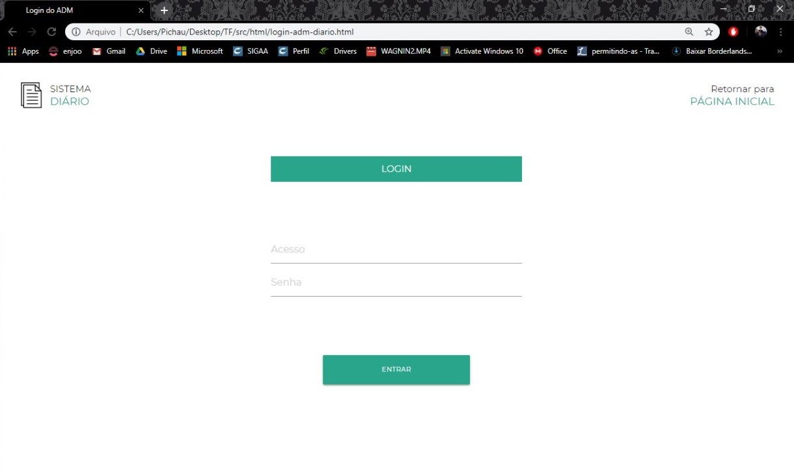
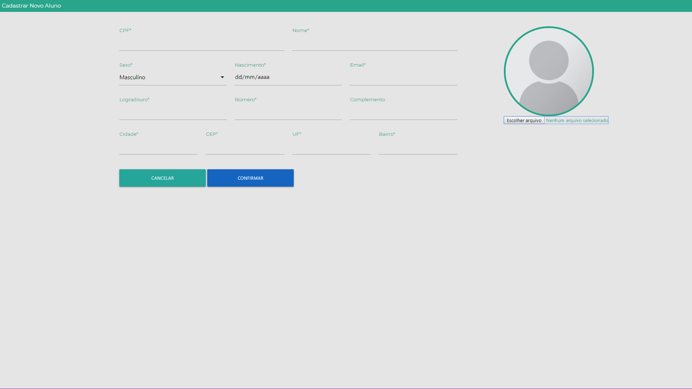

# Trabalho Final

---

## Semana 1

---

## Grupo 0 | A

---

Foram feitas definições gerais do trabalho.

---

### Repositório

- Organização do repositório
- Observações em cima dos outros grupos
- Code review

---

### Back-end

- Banco de dados e documentação dos mesmos
- Autenticação geral

---

### Front-end

- Definição do Figma para criação dos layouts das páginas
- Definição do framework materialize para facilitar a estilização
- Criação das telas administrativas

---

#### Sistema Biblioteca

%%%

Homepage


%%%

Login


---

#### Sistema Diário

%%%

Homepage


%%%

Login


---

## Grupo 1 | B

---

Foram criados aspectos da comunicação aplicação-servidor.

---

### Nikolas e Jonata

- Implementação da **_manutenção da tabela Professores_**, pelo servidor - Inserir o registro de um professor - Alterar o registro de um professor - Deletar o registro de um professor - Consultar e retornar os dados de professores (**XML**)

%%%

### Nikolas

Estudo de alternativas para envio de email

---

### Indra e Amanda

- **_Fazer requisições_** pela aplicação web para manipulação do banco de dados

  - Inserir registros em Professores/Acervo
  - Remover registros em Professores/Acervo
  - Deletar registros em Professores/Acervo
  - Consultar registros em Professores/Acervo

- Usar resposta _XML_ para **_imprimir dados em tabela_**

%%%

### Jonata

- Revisão e adaptação da estrutura comunicando com os gerentes

---

### Estrutura XML

```xml
<root>
    <info>
        <erro>true/false</erro>
        <mensagem></mensagem>
        <causa></causa>
    </info>
```

%%%

```xml
    <professores>
        <professor>
            <id></id>
            <id-depto></id-depto>
            <nome></nome>
            <senha></senha>
            <email></email>
            <titulacao></tirulacao>
        </professor>
        <!-- ... -->
    </professores>
</root>
```

---

## Grupo 6 | G

---

### Estudo e prática

- Git/GitHub
- Requisições HTTP
- JavaFX

---

### Manutenção de departamentos

#### Servidor

- Consulta
- Inserção
- Atualização
- Remoção

---

### Manutenção de departamentos

#### Servidor

Padrão de projeto de software MVC (Model-View-Controller)

%%%

Diagrama


---

### Manutenção de departamentos

#### Front-end da aplicação web

- Página que exibe departamentos em uma tabela

---

## Grupo 2 | C

---

Foram adicionadas as funcionalidades de Manutenção de Disciplinas no servidor

---

## Servidor

#### Funcionalidades adicionadas

- Inserir Disciplinas
- Deletar Disciplinas
- Atualizar Disciplinas
- Consultar por Disciplinas no BD

---

## Servidor

Todas as requisições a API de disciplinas seguem um seguinte padrão de rotas que é:

`http://localhost:8080/app/diario/disciplina/{operação}`

onde operação pode ser `consultar`, `consultarporid`, `deletar`, `alterar`, `inserir`

---

## Estrutura do XML

xml de Disciplina:

```xml
<disciplinas>
    <disciplina>
        <id></id>
        <id-turmas></id-turmas>
        <nome></nome>
        <carga-horaria-min></carga-horaria-min>
    </disciplina>
</disciplinas>
```

%%%

xml de erro:

```xml
<erro>
    <mensagem></mensagem>
</erro>
```

xml de sucesso:

```xml
<sucesso>
    <mensagem></mensagem>
</sucesso>
```

---

## Grupo 3 | D

---

Foram criadas funcionalidades para manutenção da tabela 'Etapas'

---

### Servidor

Criação de servlets para _inserção_, _alteração_, _exclusão_ e _consulta_ da tabela 'Etapas'.

Cada uma das funcionalidades pode ser acessada pelo endereço `http://localhost:8080/app/diario/etapas/{funcionalidade}`.

---

### Respostas em XML

#### Inserir, alterar ou excluir

```xml
<{status}>
    <mensagem>{conteúdo da mensagem}</mensagem>
</{status}>
```

onde status pode ser _erro_ ou _sucesso_.

%%%

#### Consulta

```xml
<etapas>
   <etapa>
       <id></id>
       <ano></ano>
       <valor></valor>
   </etapa>
</etapas>
```

---

## Grupo 4 | E

---

### Estudo e prática

- Git/GitHub
- Requisições HTTP

%%%

### Aliado a gerência

#### Design dos sistemas

- Padronização de interface
- Telas principais de ambos sistemas

---

### Sistema Biblioteca

#### Back-End

- Requisição e resposta
- Funcionalidade de Descarte (I)

---

### Sistema Diário

- Lançamento e consulta de faltas
- Lançamento de atividades
- Lançamento e consulta de conteúdo

---

## Grupo 5 | F

---

Na primeira semana nosso grupo focou na parte de manutenções (alunos e campi), desenvolvendo back-end e o front-end da parte Web.

---

### Servidor

Foram adicionadas as funcionalidades para a **manutenção de campi** referente ao sistema de diário acadêmico
Além disso já estamos avançados no desenvolvimento das mesmas para a **manutenção de alunos**, também do diário acadêmico.

---

#### Como funciona

Ao acessar, a partir do servidor, o caminho `/diario/{area}/{função}` , (onde _área_ seria campi ou alunos, e _função_ seria inserir, alterar ou deletar), é possível realizar essas funcionalidades, recebendo uma resposta XML que indica se a operação foi bem sucedida ou se ocorreu um erro, o qual também é indicado na reposta.

---

### Front-end

Criamos as páginas Web para manutenção de campi e alunos, seguido o layout e estilização estabelecidos pela Gerência.

%%%

#### Exemplo



---

## Grupo 7 | H

---

Foram adicionados funcionalidades fundamentais para o prosseguimento do desenvolvimento do projeto.

---

### O servidor

Foi adicionado a parte de _manutenção de cursos_ do sistema de diário acadêmico

Acessando, do endereço base do servidor, o caminho `/diario/cursos/{funcionalidade}` é possivel realizar requisições, recebendo uma resposta XML do mesmo.

---

#### Funcionalidades

- Consultar cursos
- Deletar cursos
- Inserir cursos
- Atualizar cursos

---

### O front-end

Foi criada uma página exemplo para testar as rotas do servidor brevemente estilizada.

Esta é capaz, portanto de realizar todas funções do servidor citadas acima (_consultar, deletar, inserir e atualizar_).

%%%


---

## Grupo 8 | I

---

### Front-end Web

Desenvolvida uma tela para modificar a tabela das turmas.
A interface já está pronta, mas não faz comunicações com o banco de dados ainda.

%%%


---

### Começo front-end Desktop

**Impedimento**: falta da definição para estilização

---

### Back-end Web

Funções de manipulação na tabela _turmas_:

1. Inserir turmas
2. Modificar turmas
3. Deletar turmas
4. Exibir turmas

%%%

**Impedimento**: Não pôde ser concluída por causa de dificuldades com a instalação do Glassfish (Mas agora já conseguimos instalar)

---

## Fim
