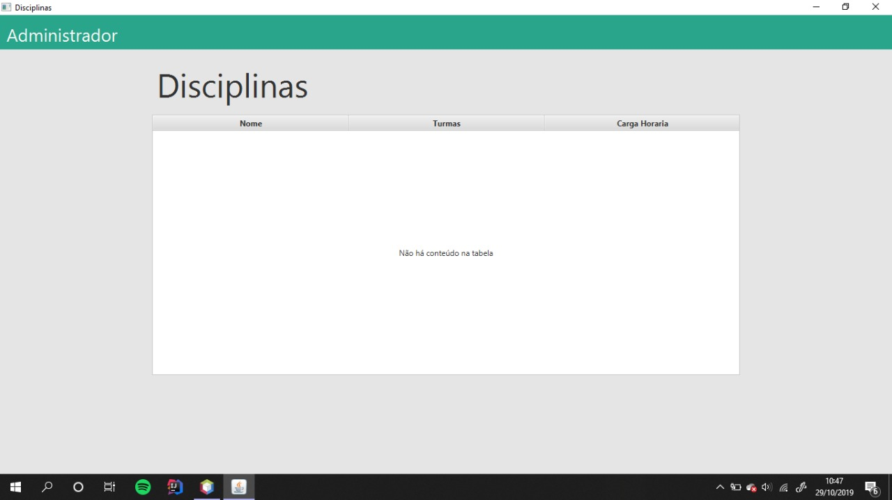
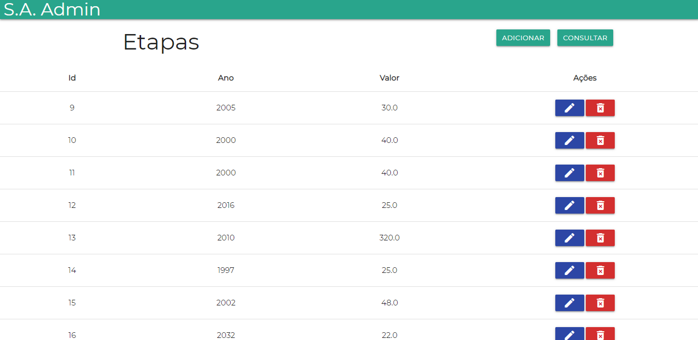
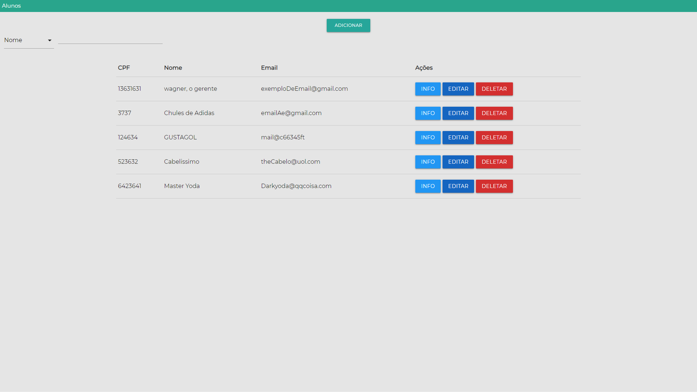
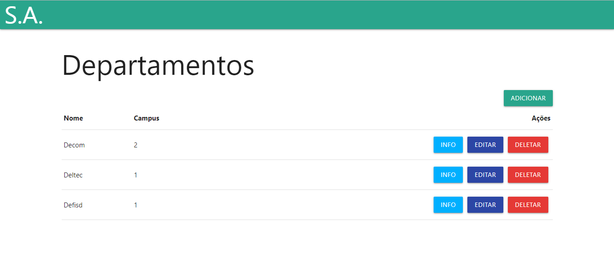
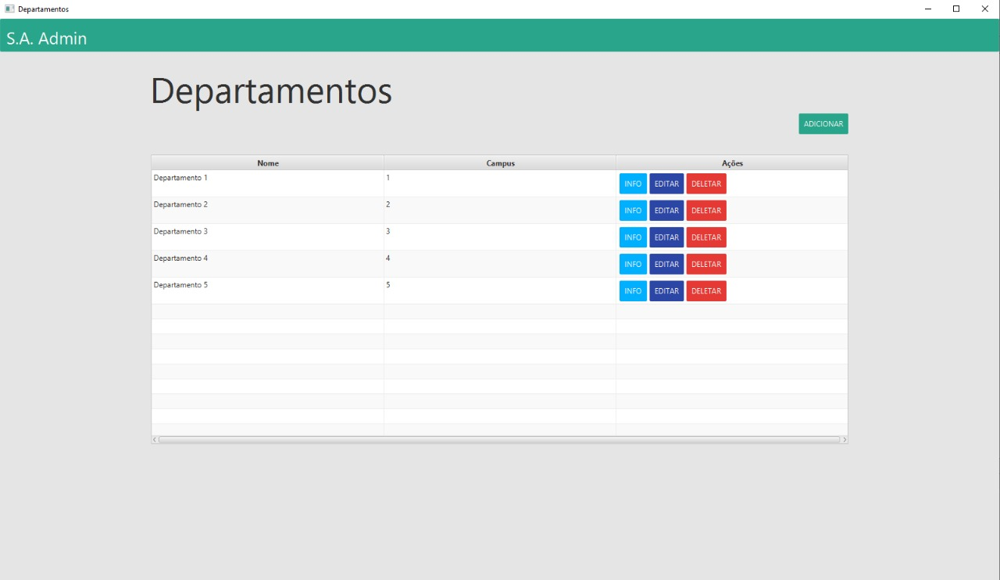
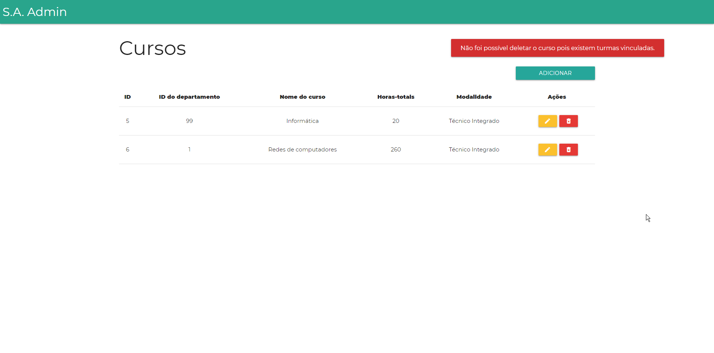
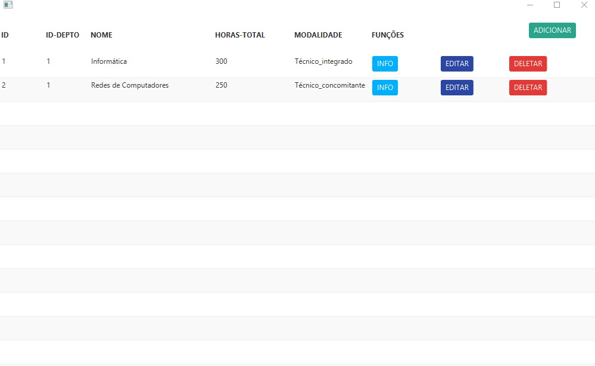
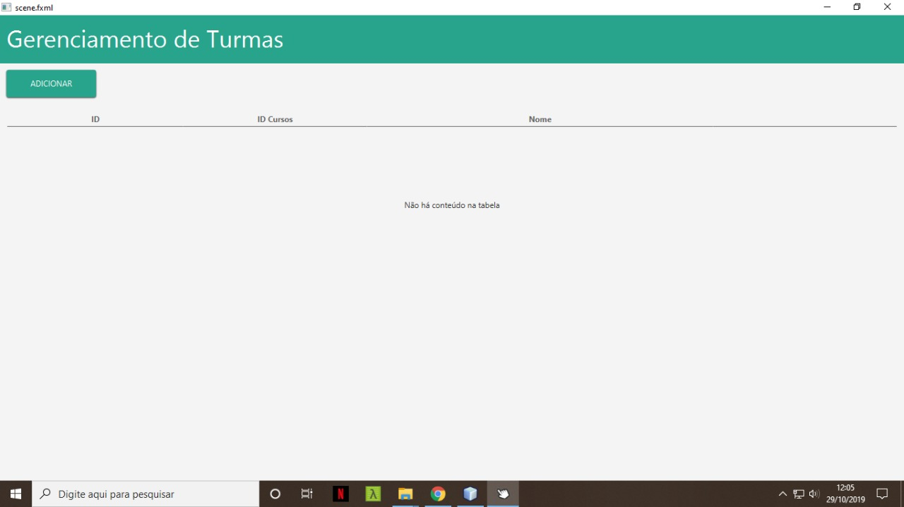

# Trabalho Final

---

## Semana 2

---

## Grupo 0 | A

---

## O que era pra ter sido feito

%%%

Nossos planos da semana:

- ✅ Ajudar os demais grupos
- ✅ Autenticação administrativa
- ✅ Feedback dos outros grupos
- ✅ Login e páginas inicias do web

---

## O que foi feito

%%%

#### Ajudar os demais grupos

Para os grupos que solicitaram, foi fornecida ajuda nos mais diversos itens.

%%%

**Foram revisados _15_ PR's do servidor**

A parte de diário do servidor está muito próxima de ser encerrada...

%%%

#### Autenticação administrativa

Foi finalizar a parte de autenticação e cadastro de administradores, contendo já um registro inicial no banco de dados.

%%%

#### Figma

Foram atualizadas as telas de listagem, operações e descartes no _Figma_.

%%%

#### Feedback

Foi conversado individualmente com cada líder de grupo.

%%%

#### Web

<!-- Wagneeeerrrrrrrr -->

---

## O que iremos fazer

%%%

#### Exemplificar as requisições

Um de nossos planos é adicionar algumas requisições padrão do _Insomnia_ para facilitar o entendimento e testagem do servidor.

%%%

#### Tentar suprir os outros grupos

%%%

#### O de praxe

---

## Grupo 1 | B

---

## O que foi proposto

%%%

#### Terminar manipulações em BD

- ✅ Inserir acervo
- ✅ Remover acervo
  - ✅ Enviar email
- ✅ Atualizar acervo
- ✅ Consultar acervo

%%%

#### Começar Front-end

- ✅ listar professores
- ✅ modal de edição
- ✅ modal de remoção

---

## O que foi feito

%%%

#### Nikolas

- Solução do envio de E-Mail

#### Jonata

- Consulta no _acervo_
- Remoção no _acervo_

%%%

#### Indra

- Inserção no _acervo_
- Atualização no _acervo_

#### Amanda

- Front-end listagem

---

## O que vamos fazer

%%%

#### Terminar back-end

- login do _professor_

#### Terminar front-end da aplicação web

- listagem do _acervo_

#### Começar front-end da aplicação desktop

- listagem dos _professores_

---

## Grupo 2 | C

---

Foram adicionadas as funcionalidades de Manutenção de Empréstimos no servidor
front end Web de manutenção de Disciplinas

---

## O que foi proposto

- Front-end web de manutenção de Disciplinas
- Back-end de Manutenção de emprestimos
- Fazer requisições no Desktop( Ideia abandonada )

---

## O que foi feito

---

## Gabriel

Responsavel pelo Back-end de Manutenção de emprestimos
as rotas possiveis de se acessar são descritas pela url:

`http://localhost:8080/app/biblioteca/emprestimos/{operação}`

onde operação pode ser `consultar`, `consultarporid`, `deletar`, `inserir`

---

## Marcus e Guilherme

Responsaveis pelo Front-end de Manutenção de Disciplinas

- Interface web com o usuario
- Requisições para o servidor

%%%


---

## Isabella

Responsável pela aplicação Desktop

%%%



---

## O que iremos fazer

- Front-end web de empréstimos
- Back-end de reservas
- Front-end Desktop Disciplinas e empréstimos

---

## Grupo 3 | D

---

## O que foi proposto

- Sistema acadêmico: front-end da manutenção de etapas
- Biblioteca: início dos relatórios

---

## O que foi feito

### Sistema acadêmico

Foi possível finalizar o front-end web completamente.

---



---

## O que foi feito

### Biblioteca

Não foi possível realizar os relatórios devido à indefinição de como os mesmos funcionariam.

---

## Próxima semana

- Finalizar a página de relatórios
- Iniciar o front-end desktop

---

## Grupo 4 | E

---

## O que foi proposto

---

### Biblioteca

- Finalização de Descartes WEB
- Front-End completo WEB
- Inicialização de Descartes Desktop

%%%

### Diário

- Front-End completo WEB
- Respostas XML

---

## O que foi feito

- Respostas XML
- Inicialização de Descartes Desktop
- Finalização de Descartes WEB
- Front-End

%%%


---

## O que iremos fazer

- Finalização de Descartes Desktop
- Inicialização do Diário do Aluno
- Finalização Diário WEB

---

## Grupo 5 | F

---

## O que foi proposto

- Servidor: Finalizar o back-end das manutenções
- Front-end (Web): Finalizar o front-end das manutenções na aplicação web

---

## O que foi feito

---

### Servidor

- Implementada validação de permissão para manutenções de aluno e campi
- Adição de métodos de consulta e listagem
- Melhoria na funcionalidade de deletar

---

### Front-end Web

- Finalização das páginas de manutenção, já conectadas e fazendo requisições ao BD

%%%



---

## O que iremos fazer

---

### Front-end Web

- Fazer perfil e login de aluno

%%%

### Relatorios

- Histórico Escolar

%%%

### Front-end Desktop

- Começar o desenvolvimento do front-end

---

## Grupo 6 | G

---

## O que foi proposto

---

Conclusão da manutenção de departamentos:

- Aperfeiçoamento do servidor
- Finalização do front-end web
- Conclusão do front-end desktop

---

## O que foi feito

---

### Aperfeiçoamento do servidor

- Melhoria na estrutura
- Verificação de parâmetros na inserção, atualização e remoção de departamentos
- Retorno de mensagens de sucesso e erro

---

### Finalização do front-end web

Adicionadas opções de inserção, atualização e remoção dos departamentos

%%%



---

### Listagem de departamentos no front-end desktop

%%%



---

## O que iremos fazer

---

- Finalização da manutenção de departamentos na aplicação desktop
- Transferência de alunos no servidor
- Página web que solicite CPF para transferência de um aluno
- Tela na aplicação desktop que solicite CPF para transferência de um aluno

---

## Grupo 7 | H

---

## O que foi proposto

- _Servidor:_ Término do servidor + segurança e autenticação.

- _Web:_ Inserção de cursos ao banco de dados por meio da aplicação.

- _Desktop:_ Conexão e operações simples com o banco de dados.

---

## O que foi feito

- _Servidor:_ Término do servidor + segurança e autenticação (_proposta cumprida_).

- _Web:_ Finalização da parte de manutenção de cursos, seguindo os estilos padronizados. (_proposta cumprida + adiantamento_)

- _Desktop:_ Conexão e operações com o banco de dados e apresentação do conteúdo em tabela, com estilização (_proposta cumprida + adiantamento_)

%%%



%%%



---

## O que será feito

- _Web:_ Relatórios do sistema de bibliotecas (atrasos, multas recebidas e obras descartadas).

- _Desktop:_ Finalização da manuteção de cursos do sistema de diário acadêmico.

---

## Grupo 8 | I

---

## O que foi proposto

- Terminar tarefas pendentes da manutenção de turmas
- Relatório 10: "Relação por seleção de aluno, listando as notas, nas respectivas disciplinas, por etapa" (Front end e back end)

---

## O que foi feito

%%%

## Aplicação Web

- Comunicação da página web com o servidor
  - Permite a inserção, remoção e alteração de turmas
  - Também faz consulta à tabela de cursos, permitindo ao usuário escolher um curso em vez de inserir diretamente o ID do curso
  - Usa método Post

%%%

## Servidor

**Manutenção de turmas**

- Padronização das URLs usadas para comunicar com o servidor e seu XML de resposta

%%%

**Sucesso:**

```xml
<sucesso> Mensagem de sucesso </sucesso>
```

**Erro:**

```xml
<erro> Mensagem de erro </erro>
```

%%%

**Consulta:**

```xml
<turmas>
     <turma>
          <id></id>
          <id-cursos></id-cursos>
          <nome></nome>
     </turma>
</turmas>
```

%%%

## Aplicação Desktop

**Manutenção de turmas**

- Layout do gerenciador de turmas, conforme os padrões estabelecidos

%%%



---

## O que iremos fazer

**Manutenção de turmas**

- Terminar o layout do aplicativo desktop e implementar suas funcionalidades, de forma que ele fique semelhante à página web
- Fazer a parte relacionada ao relatório 10
