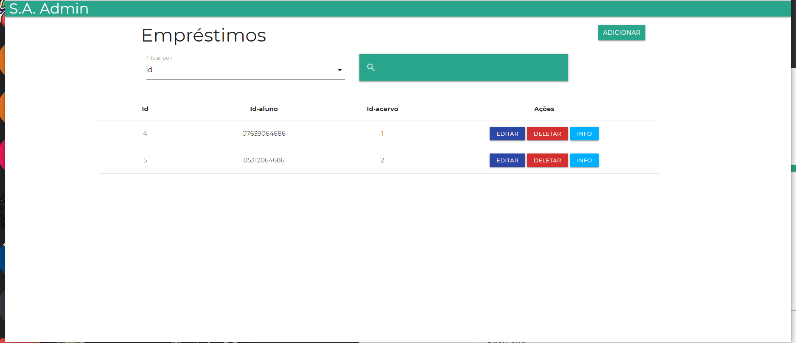
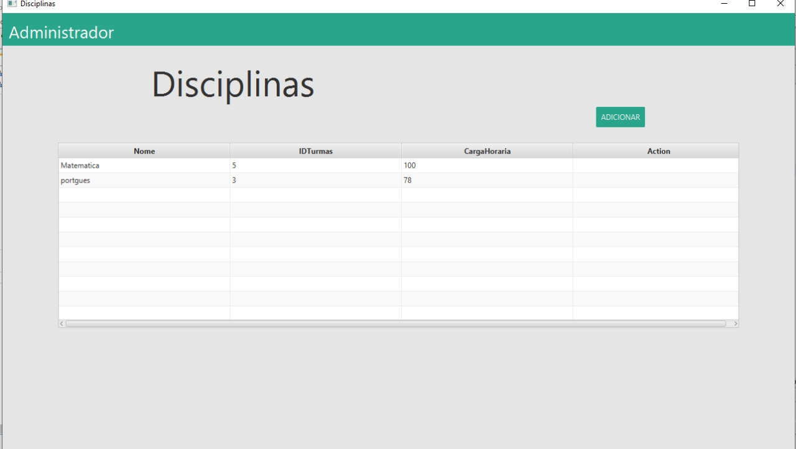
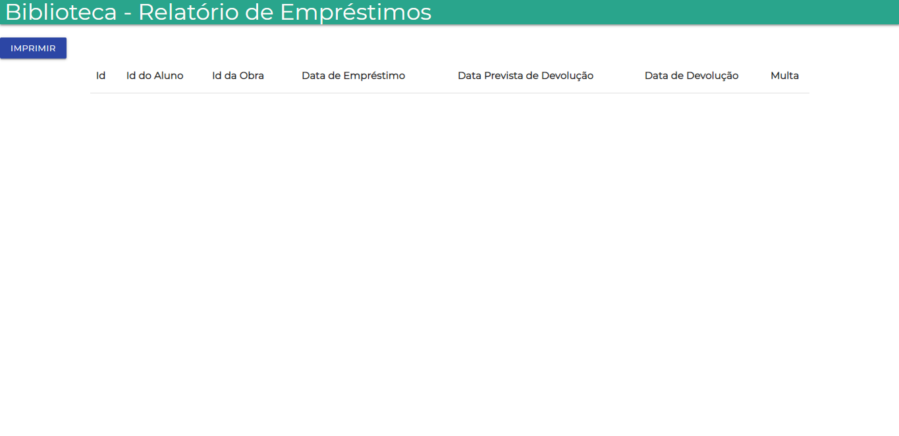
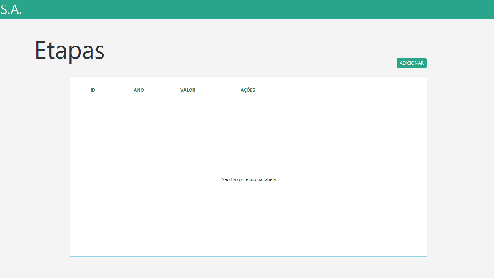
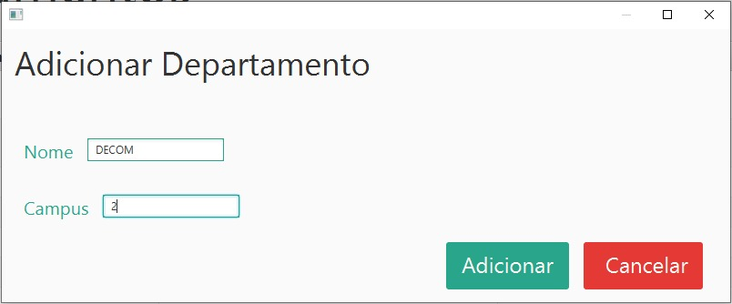
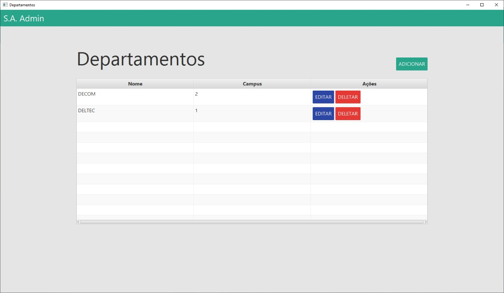
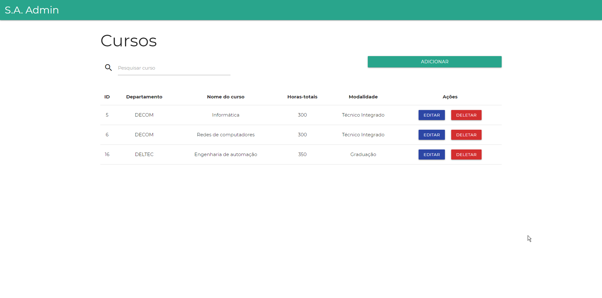
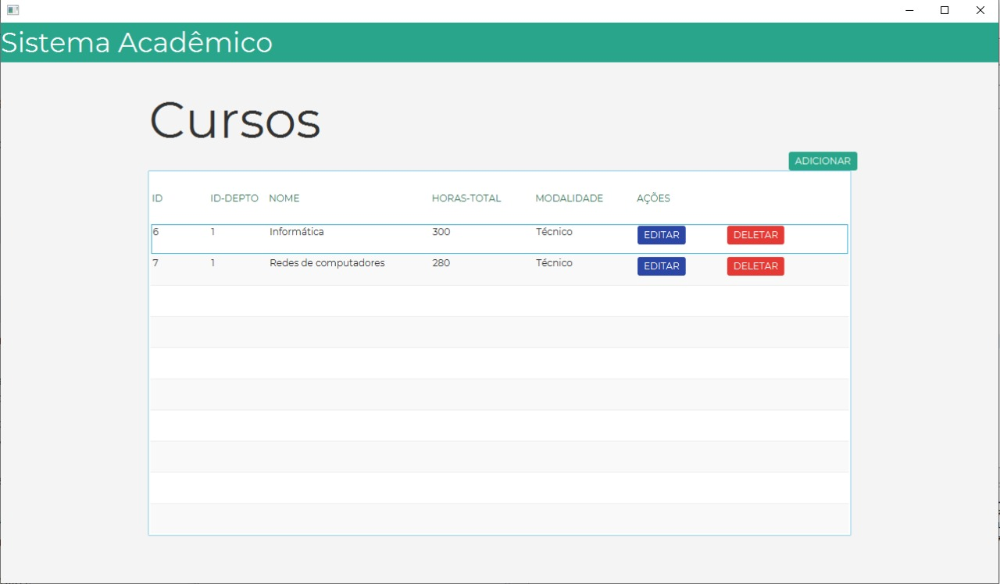
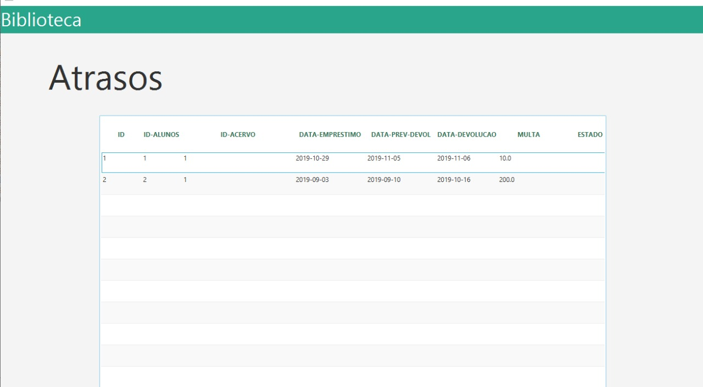

# Trabalho Final
---

# Semana 3

---

## Grupo 1 | B

---

### O que foi proposto

%%%

- ✅ **Login** do professor

- ✅ **Listagem** do acervo na _aplicação web_

- ✅ **Listagem** dos professores na _aplicação desktop_

---

### O que foi feito

%%%

#### Indra e Amanda

- Consertaram um erro em **Listagem** dos professores _aplicação web_

%%%

#### Jonata

- **Conserto** de uma falha no _back-end_
- **Login** do professor no _back-end_
- **Listagem** do acervo na _aplicação web_

%%%

#### Nikolas

- **Listagem** dos professores na _aplicação desktop_

---

### O que vai ser feito

%%%

#### Finalizar Desktop

- **Listagem** acervo na _aplicação desktop_

- **Login** do professor na _aplicação desktop_

%%%

#### Perfil do Professor

- No servidor

- Na aplicação web

- Na aplicação desktop

---

## Grupo 2 | C

---

### O que foi proposto

%%%

#### Front-end Aplicação Web

- ❌ Finalizar Manutenção de Empréstimos

%%%

#### Back-end

- ✅ Adicionar autenticação na tabela Empréstimos
- ✅ Manutenção de Reservas

%%%

#### Front-end Aplicação Desktop

- ✅ Finalizar Manutenção Disciplinas
- ❌ Finalizar Manutenção de Empréstimos

---

### O que foi feito

%%%

#### Front-End Aplicação Web

Basicamente estamos a um passo de terminar a tabela empréstimos, porém estamos com dificuldade na parte de data.

%%%

%%%

#### Back-end

Com o término de Manutenção de Reservas, a parte de Back-end é terminada.

%%%

#### Front-end Aplicação Desktop

Devido à Aplicação Desktop ainda estar no começo o grupo teve muita dificuldade, não conseguindo fazer tudo o que foi proposto.

%%%

---

### O que será feito

%%%

#### Front-end Aplicação Web

- Finalizar Manutenção de Empréstimos
- Finalizar Manutenção de Reservas

%%%

#### Front-end Aplicação Desktop

- Finalizar Manutenção de Empréstimos
- Finalizar Manutenção de Reservas

---

## Grupo 3 | D

---

### O que foi proposto

- Biblioteca: finalização dos relatórios 1, 2 e 3(acervo, obras emprestadas e reservas) na Aplicação Web
- Sistema acadêmico: inicialização da Manutenção de Etapas na Aplicação Desktop

---

### O que foi feito

#### Matheus

- Relatórios

#### Arthur

- Estilização dos relatórios
- Implementação da função de imprimir

%%%

---

## O que foi feito

#### Enzo

- Front-end na Aplicação Desktop

#### Iago

- Comunicação com o servidor na Aplicação Desktop

%%%

---

## O que faremos na próxima semana

- Finalizaremos a Manutenção de Etapas na Aplicação Desktop
- Faremos os relatórios na Aplicação Desktop

---

## Grupo 4 | E

---

### O Que Foi Proposto

%%%

#### Finalização de Descartes

- ✅ Front-End de Descartes na Aplicação Desktop
- ✅ Back-End de Descartes na Aplicação Desktop

%%%

#### Diário

- ✅ Inicialização do Diário do Aluno
- ❌ Finalização do Diário Professor na Aplicação Web

---

### O Que Fizemos

%%%

#### Marcus

- Front-End completo de Descartes na Aplicação Desktop
- Ínicio do front-end de Diário na Aplicação Desktop

#### Dornelas

- Back-End de Descartes na Aplicação Desktop

%%%

#### Juan

- Back-End do Diário do Professor

#### Nicoly e Julia

- Front-End do Diário do Professor e do Aluno
- Reformulações do Diário

---

### O Que Faremos

%%%

#### Aplicação Web

- Lançamento de Notas das atividades
- Lançamento de Faltas e do conteúdo
- Diário do Aluno

#### Aplicação Desktop

- Finalizar o Front-End
- Iniciar o Back-End do Diário

---

## Grupo 5 | F

---

### O que foi proposto

%%%

- ✅ **Login e perfil** do aluno [Front-end]

- ❌ **Histórico Escolar**

- ✅ Começar front-end da Aplicação Desktop

---

### O que foi feito

%%%

#### Osmar e Henrique

- Perfil do aluno

%%%

#### Pedro Augusto

- Conexão do perfil de aluno com o back-end
- Correção de erros no front e back-end

%%%

#### Maria Luiza e Lucca

- Telas de listagem, cadastro e edição de alunos
- Telas de cadastro e edição de campi

---

### O que vai ser feito

%%%

#### Finalizar Desktop

- Fazer todas as telas restantes de aluno e campi

%%%

#### Manutenção de alunos (biblioteca)

- Aplicar a tela do diario na parte de biblioteca

- Poucas mudanças necessárias

%%%

#### Relatórios

- Relatório 8

- Relatório 9

---

## Grupo 6 | G

---

### Aplicação desktop

%%%

#### O que foi proposto

- Finalização da Manutenção de Departamentos
- Tela que solicita CPF para transferir um aluno

%%%

#### O que foi feito

- Operações de inserção, atualização e remoção de departamentos
- Tela que solicita CPF

%%%

---

%%%

#### O que será feito

- Aprimoramento da Manutenção de Departamentos
- Realização da transferência do aluno
- Liberação do histórico

---

### Aplicação web

%%%

#### O que foi proposto

- Criar uma página que solicite o CPF de um aluno
- Fazê-la comunicar com o servidor
- Realizar a transferência do aluno

%%%

#### O que foi feito

- Criar uma página que solicite o CPF de um aluno
- Fazê-la comunicar com o servidor
- Realizar a transferência do aluno

%%%

#### O que será feito

- Aprimorar página da manutenção de departamentos

---

## Grupo 7 | H

---

### O que foi proposto

%%%

#### Aplicação Web

- ✅ Finalizar Manutenção de Cursos
- ❌ Finalizar relatórios 4, 5 e 6 do sistema de biblioteca

%%%

#### Aplicação Desktop

- ✅ Finalizar Manutenção de Cursos

---

### O que foi feito

%%%

### Web

%%%

- Finalização da parte de Manutenção de Cursos, seguindo os estilos padronizados.

%%%

#### Guilherme

Estilização completa da página, seguindo o padrão definido no Figma.

%%%

#### Arthur

Requisições ao servidor e funcionalidade/dinamicidade da página

%%%

%%%

- Início das páginas dos relatórios 4, 5 e 6

%%%

### Desktop

%%%

#### Ruan

- Finalização da parte de Manutenção de Cursos, seguindo os estilos orientados pela gerência. (Sistema de diário acadêmico)

%%%

%%%

#### Samuel

- Início das páginas de relatórios (sistema de biblioteca)
- Início da interface de escolha para relatórios
- Pesquisa de métodos para impressão

%%%

---

### O que será feito

%%%

### Aplicação Web

%%%

Finalização dos relatórios do sistema de bibliotecas (atrasos, multas recebidas e obras descartadas).

%%%

### Aplicação Desktop

%%%

Páginas de relatórios do sistema de biblioteca (atrasos, multas recebidas e obras descartadas).

---

## Grupo 8 | I

---

### O que era para ter sido feito

Nossos planos da semana:

- ✅ _Manutenção de turmas_: Terminar o layout da Aplicação Desktop e implementar suas funcionalidades, de forma que ele fique semelhante à página da Aplicação Web
- ✅ Fazer a parte relacionada ao relatório 10

---

### O que foi feito

%%%

#### Aplicação Web

**Manutenção de turmas**

- CSS quase finalizado (Raquel)

%%%

**Relatórios**

- Relatórios 10 e 11 iniciados (Vítor)
  - Não puderam ser concluídos pois há partes que dependem de outros grupos
  - Não parece ser necessário criar servlets adicionais para os relatórios, pois as informações que precisamos já podem ser obtidas com os servlets existentes

---

- Menu de relatórios (Pedro Henrique)
  - Feito, mas ainda não faz a comunicação com os relatórios

---

#### Aplicação Desktop

**Manutenção de turmas**

- Quase finalizado (Isadora e Pedro Henrique)
  - Falta comunicação com o back-end

%%%

**Relatórios**

- Layout do relatório 10 finalizado (Isadora)

---

### O que iremos fazer

- Terminar relatórios 10 e 11
- Finalizar CSS da manutenção de turmas
- Comunicação do menu de relatórios com os relatórios

---

## Grupo 0 | A

---

### O que foi proposto

%%%

- ✅ Auxiliar os outros grupos
- ❌ Exemplificar as requisições utilizando _Insomnia_

---

### O que foi feito

%%%

#### Daniel

- Criação da parte de matrícula no back-end na tentativa de aliviar os outros grupos
- Revisão de PR's

---

#### Wagner

- Padronização de partes da Aplicação Web

---

#### Thiago

- Padronização de partes da Aplicação Desktop

---

#### Todos

- Auxílio aos grupos nos laboratórios e via Discord

